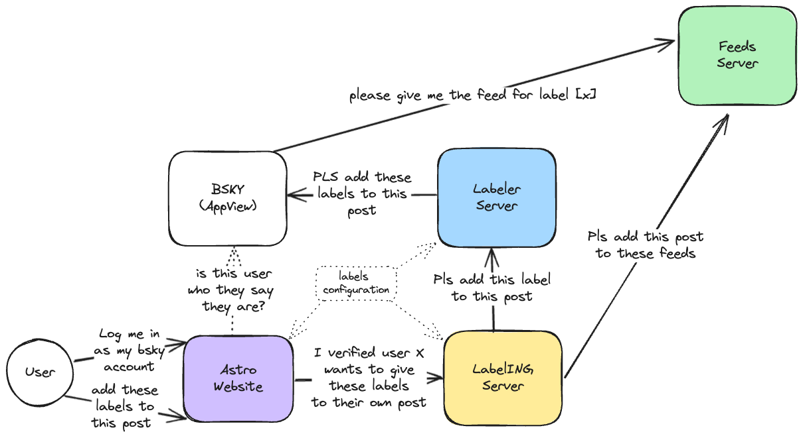
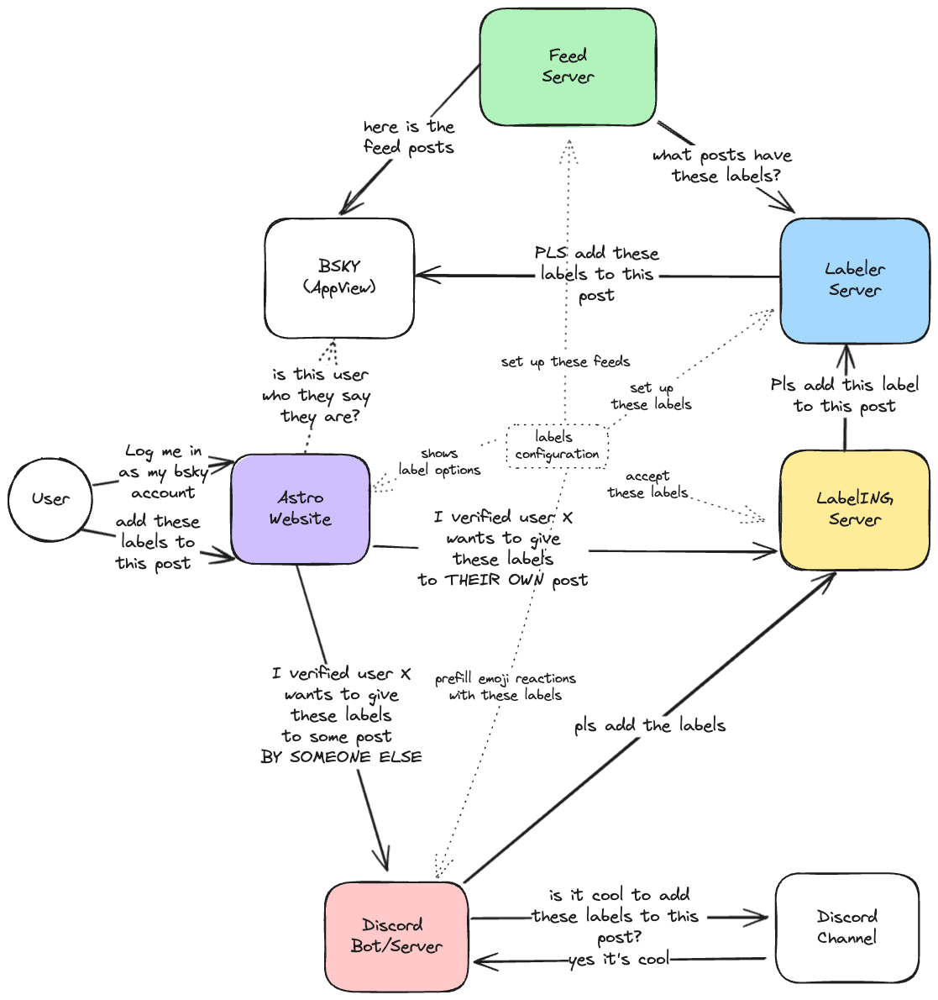

# Phase 1 — Self-serve labeler

In this phase only the owner of a post can label a post with the
selected labels. We verify that the user is the owner when they
share the link to the Astro site, and then send the request to
our labelING server.

# Phase 2 — With Feeds

In this phase we're going to add a feed for each type of label, plus a feed for every labeled post.

# Phase 3 — Moderated labeler

In this phase, the label request is sent to a Discord server for
approval and/or moderation.

